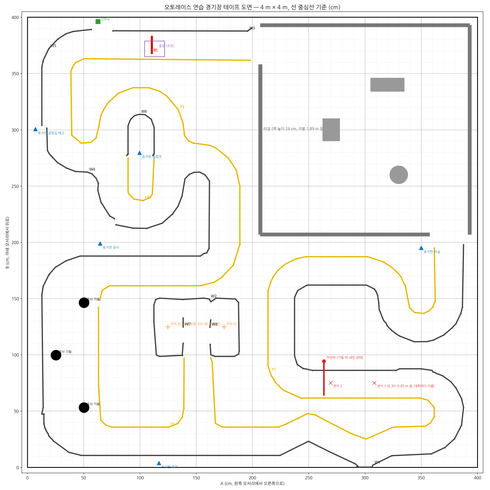

# AutoRace 2023 — TurtleBot3 자율주행

오토레이스(AutoRace) v.2023.1 의 여섯 미션을 TurtleBot3 Burger 로 완주하기 위한 ROS 2
워크스페이스다. Gazebo Harmonic 시뮬레이션에서 먼저 완주시키고, 같은 코드를 실제 로봇으로
옮기고 있다.

- ROS 2 **Jazzy**, Ubuntu 24.04, Gazebo Harmonic (gz-sim 8)
- 로봇: TurtleBot3 **Burger** (Raspberry Pi 4 + OpenCR), 카메라 2대 (전방: 표지판·신호, 하향: 차선)

| 브랜치 | 내용 |
|---|---|
| `master` | 시뮬레이션. 코스, 미션 전체, 시뮬 파라미터 |
| [`real`](../../tree/real) | 실제 로봇. Pi 카메라 노드, 실차 파라미터, 카메라 거치대, 실차 도구 |



## 미션

| 미션 | 하는 일 | 노드 |
|---|---|---|
| 신호등 | 정지선에 서서 녹색이 켜질 때 출발 | `traffic_light_mission` |
| 갈림길 | 좌/우 표지판을 읽고 그쪽 길로 | `intersection_mission` |
| 공사 구간 | 라이다로 장애물을 피해 통과 | `construction_mission` |
| 주차 | 빈 칸을 찾아 들어갔다 나오기 | `parking_mission` |
| 차단바 | 바가 내려오면 정지, 올라가면 통과 | `level_crossing_mission` |
| 터널 | 어두운 장애물 구간을 라이다로 빠져나오기 | `tunnel_mission` |

미션 순서는 대회 당일 공개되므로 하드코딩하지 않는다. `mission_manager` 가 표지판과 신호를
보고 미션을 바꾸고, 미션이 실패해도 차선 주행으로 돌아가 나머지를 계속한다. 30 초 정지는
경기 종료이므로 모든 정지 동작에 타임아웃과 탈출 동작이 있다. 자세한 설계는
[docs/DESIGN.md](docs/DESIGN.md).

## 구조

```
src/
  autorace_sim/         Gazebo Harmonic 코스, 신호등·차단바 구동, 로봇 모델, sim_firmware
                        (실제 로봇의 속도·회전 한계를 시뮬에 적용)
  autorace_perception/  BEV 투영(카메라 높이·피치로 계산), 차선·정지선·표지판·신호등·차단바 검출
  autorace_core/        mission_manager, 미션 6개, lane_controller(pure pursuit), cmd_vel_mux
  autorace_bringup/     런치 파일과 파라미터 (param/*_sim.yaml, real 브랜치에 *_real.yaml)
  autorace_msgs/        메시지 정의
docs/                   설계서, 시뮬 운영 메모, 코스 도면, 작업 기록
hardware/venue_props/   연습 경기장 소품 3D 프린팅 모델(신호등, 차단바, 표지판)과 아두이노 펌웨어
```

`src/turtlebot3_autorace`, `src/turtlebot3_simulations` 는 ROBOTIS 원본으로,
`autorace.repos` 로 받아 온다 (저장소에는 들어 있지 않다).

## 빌드

```bash
cd ~/Desktop/autorace_ws
vcs import src < autorace.repos
rosdep install --from-paths src --ignore-src -y
colcon build --symlink-install
source install/setup.bash
```

## 시뮬레이션 실행

```bash
# 코스와 로봇 (카메라 2대). GPU 가 있는 노트북은 PRIME 오프로드로 띄운다.
ros2 launch autorace_sim autorace_world.launch.py

# 미션 전체
ros2 launch autorace_bringup race.launch.py

# 일부 미션만
ros2 launch autorace_bringup race.launch.py missions:=parking,tunnel

# 차선 주행만 (튜닝용)
ros2 launch autorace_bringup lane_drive.launch.py
```

`autorace_world.launch.py` 는 `camera:=dual|single|single_wide`, `gui:=false`, `rtf:=` 를
받는다. 카메라 한 대로 띄웠으면 미션도 그에 맞춰 띄운다:
`race.launch.py perception:=sim_mono_wide mission:=sim_mono_wide` (90° 카메라). 시뮬은 실제 로봇의 한계 그대로 달린다: 바퀴당 0.20 m/s, 회전 2.5 rad/s 이하.
Wayland 에서는 `QT_QPA_PLATFORM=xcb` 로 띄워야 화면이 보인다.
운영 중 알게 된 것은 [docs/SIM_NOTES.md](docs/SIM_NOTES.md).

## 실제 로봇

`real` 브랜치에 있다. 요약:

- Pi 에서 베이스(OpenCR), 라이다(LDRobot 계열, 115200 baud), 카메라를 띄우고 PC 에서
  인식과 제어를 돌린다. 영상은 JPEG 로만 Wi-Fi 를 건너고 PC 에서 디코드한다.
- Pi 카메라(imx219)는 레거시 V4L2 스택으로 읽는다. C920 같은 UVC 웹캠은 카메라가 만든 MJPEG 를
  그대로 보낸다.
- 차선 주행은 Pi 카메라(11 cm, 31° 하향)로 연습 코스 60 초 6.9 m, 차선을 놓쳐도 다시 찾는
  데까지 확인했다. 표지판은 전방 카메라가 필요하다.
- 하향 카메라용 C920 거치대: `hardware/camera_mount` (라이다 뒤 기둥 + 라이다 위로 뻗은 팔).


설치와 매번 하는 절차는 `real` 브랜치의 `docs/PI_SETUP.md`, `docs/REAL_ROBOT.md`.

## 연습 경기장

- 코스 테이프 도면: [docs/course](docs/course) (테이프 중심선 기준, cm)
- 소품: [hardware/venue_props](hardware/venue_props) — 신호등·차단바(아두이노 Mega 2560),
  표지판 받침과 스티커 원고. 치수는 시뮬 모델과 같아서 시뮬에서 맞춘 인식 파라미터가 그대로 쓰인다.
